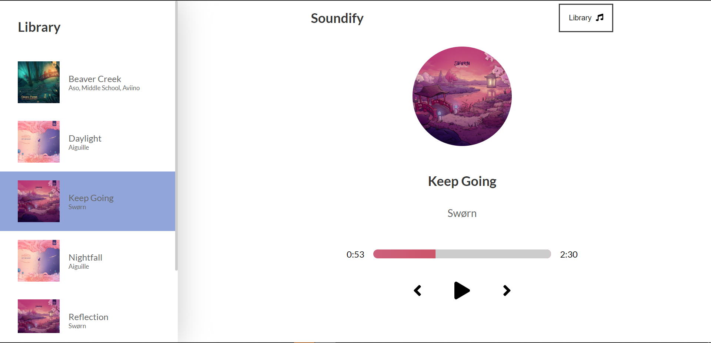

# SOUNDIFY

Player audio made with [https://reactjs.org/](React.JS)

In the project directory, you can run:

### `yarn run install`

Then runs the app in the development mode.\
Open [http://localhost:3000](http://localhost:3000) to view it in the browser.

### `yarn run dev`

